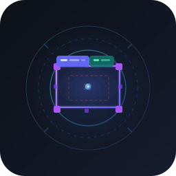

# Annoscope

<div align="center">
  
</div>

[](https://www.python.org/)
[](https://fastapi.tiangolo.com/)
[](https://www.sqlite.org/)
[](https://github.com/astral-sh/uv)
[](https://github.com/astral-sh/ruff)
[](https://pre-commit.com/)
[](https://github.com/kameshkotwani/annoscope/blob/master/LICENSE)

A fast, local-first dataset audit and annotation review tool for computer vision projects.

## The Problem

Standard annotation workflows have no good answer for the QA step. You either:
- Open images one-by-one in a file browser with no state tracking
- Spin up a heavy labelling platform (CVAT, Label Studio) just to *review* work that's already done
- Write throwaway scripts that show one image and immediately lose context

Annoscope fills that gap — purpose-built for reviewing and auditing existing YOLO/COCO datasets, not creating them from scratch.

## What It Does

- **Browse at speed** — keyboard-driven navigation through thousands of images with persistent seen/unseen tracking
- **Overlay annotations** — YOLO and COCO boxes rendered directly on images with class labels
- **Flag bad labels** — mark images with broken YOLO or COCO annotations without touching source files
- **Staged editing** — delete and restore individual boxes per image; all edits stored in SQLite, originals never modified
- **Edit mode** — full UI theme switch signals when destructive actions are live; ghost boxes show deleted annotations for restore
- **Dataset agnostic** — point it at any YOLO/COCO directory structure via a single `datasets.yaml`; no project lock-in
- **EXIF aware** — reads orientation metadata so images render correctly regardless of camera source

## Why It's Fast

- Zero network calls — everything runs locally over `localhost`
- SQLite for state — no database server, no ORM overhead, instant reads
- Static file serving for images — FastAPI mounts image directories directly, no base64 encoding or proxying
- Hardlink-based export (Phase 3) — copying 3000+ images takes seconds, not minutes

## Stack

- **Backend**: FastAPI + SQLite (via `sqlite3` stdlib)
- **Frontend**: Vanilla JS, no build step, no framework
- **Config**: Pydantic-validated YAML

## Setup

```bash
uv sync
cp datasets.yaml datasets.local.yaml   # edit paths for your machine
uvicorn app.main:app --reload
```

Open `http://localhost:8000`.

## Dataset Config

```yaml
datasets:
  - name: My Dataset
    slug: my_dataset
    images: path/to/images       # relative to project root
    labels: path/to/labels       # YOLO .txt files
    coco: path/to/annotations.json  # optional
    reports: reports/
    classes:
      0: Cat
      1: Dog
```

## Roadmap

- [x] Delete / restore boxes (staged edits)
- [ ] Move box (drag & drop)
- [ ] Add box (click & drag)
- [ ] List-view indicators for images with edits
- [ ] Dataset export with EXIF normalization
- [ ] Class visibility toggles
